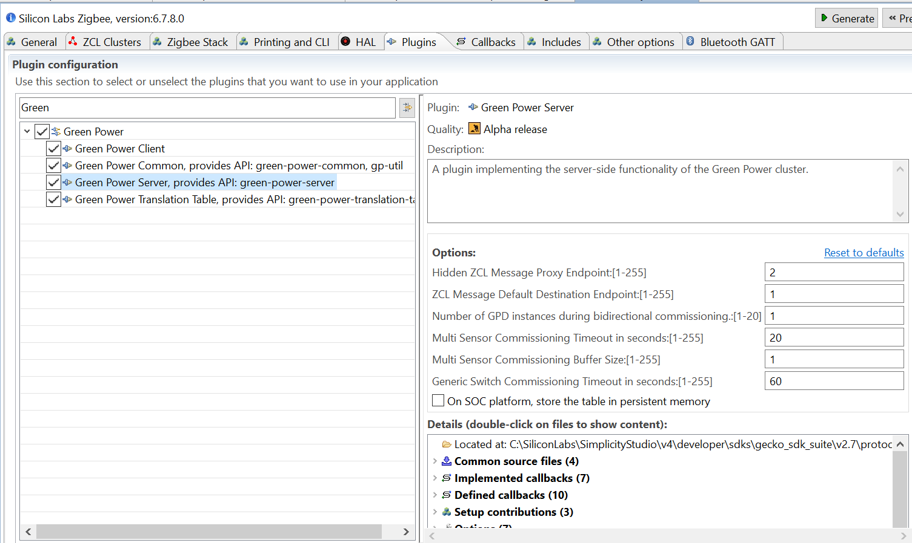

# Implement your application
Silicon Labs App Builder projects have a very specific way of being implmented:
* Plugins are provided, and bring sources in the project that cover basic implementations for you
* Stack and Plugins both define *Callback functions* that allow you to implement event driven algorithms

Be careful:
* A lot of code is generated or linked according to your ZCL and Plugin configurations
* Callback stub function definitions are handled by Appbuilder - letting you responsible of implementing the functions you selected

Consequently, your Appbuilder based application implementation is going to be split into 2 main parts, the Plugins & Callbacks implementation, and your own code.

## Plugins Callbacks and Events 
#### Plugins
Through the *"Plugin"* tab, add the following plugins (use the search bar to find it):
* Green Power Server  

* Green Power Client  
    
* Green Power Common  
    
* Green Power Translation Table  
    
* Find and Bind Initiator  
    Used to bind our device to a dicoverable Device (i.e. Light bulb)

* Find and Bind Target  
    Used to make ourselves identifiable for binding
    Might Enter in conflict with EZ Mode Commissioning Plugin as bot implement on the Identify Cluster

#### Callbacks

#### Custom Software Events

All of the previous applies only when you click the "Generate" button on top of the ISC file

## C Implementation
Now that our project has its Plugins added, we will need to implement callback functions as well as events
By default, all callback implementations go to *project_name*_callbacks.c file
We will work there in this example

-   Build and Run the generated binary located in ./build/exe
Do not forget to add the Rijndael sources:
The 2 rijndael*.c files are open source files to be downloaded (those are not Silabs copyright, hence not included in SDK purposefully) and copied to the folder developer/sdks/gecko_sdk_suite/vX.X/platform/base/hal/micro/generic/aes.

You can find these files [here](https://github.com/gagern/gnulib/tree/master/lib)

