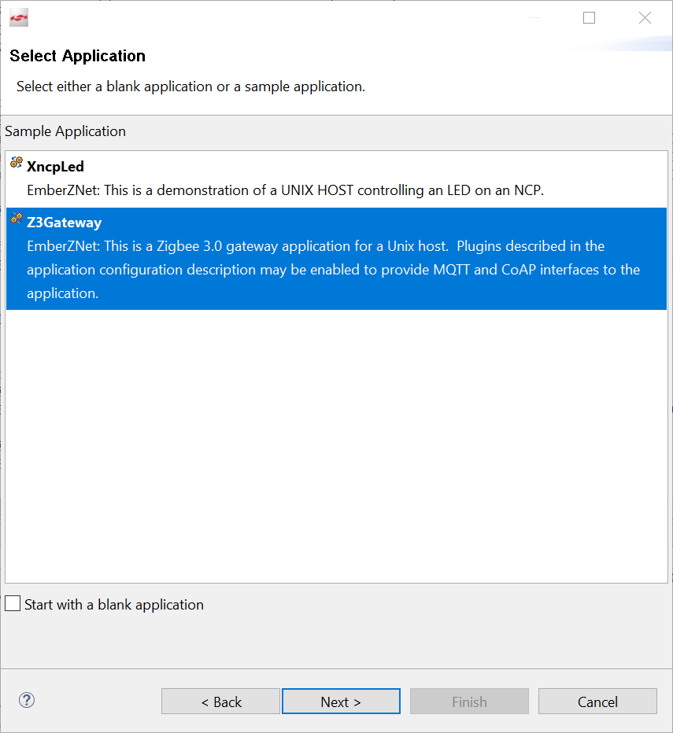
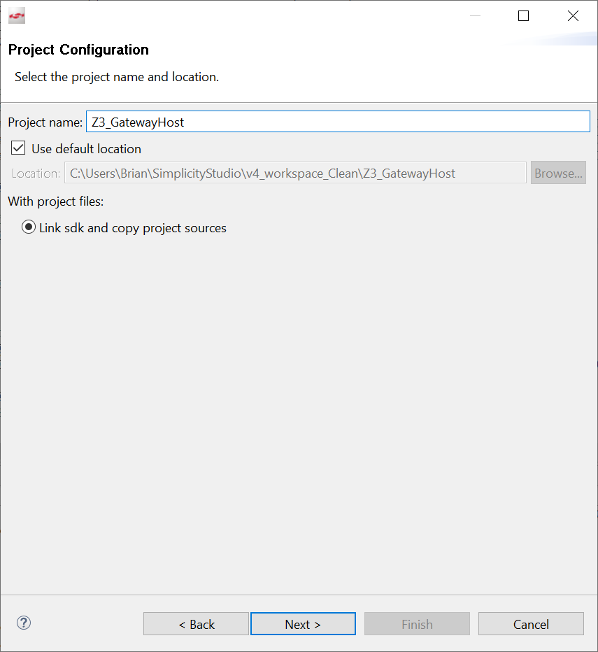
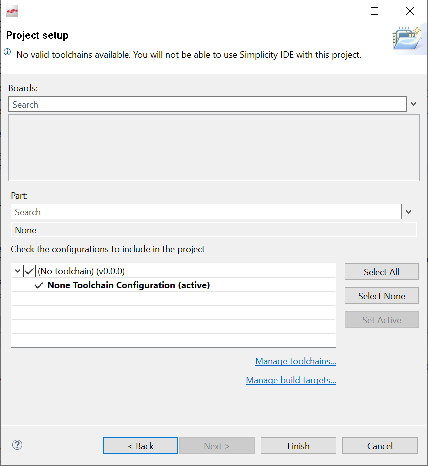
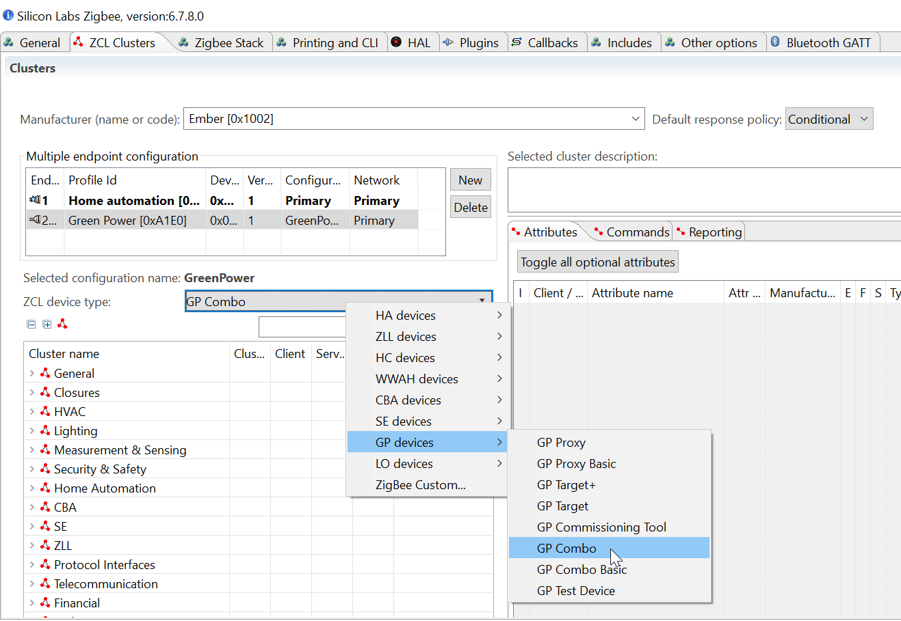

# Create and Configure the new project

## Create the project
-   Create a new Zigbee Host project based on a *Z3Gateway* project  

-   Rename your project to *Z3_GatewayHost*  

-   Set the target to *None* and No toolchain  

## Configure the project Application

-   In the ISC configuration, in the *"ZCL dusters"* tab, change *"ZCL device type"* field of the *Endpoint 242* device to *"GP Combo"*  

  

This allows our gateway to act as a Green Power Combo device

-   Finally, still in the ISC configuration file, enable *"Printing and CLI"* options according to your needs  

    Note that these options are dynamically available depending on your Plugin and ZCL configurations
    You might go back here at the end of your full project editions to see if you did not miss anything
